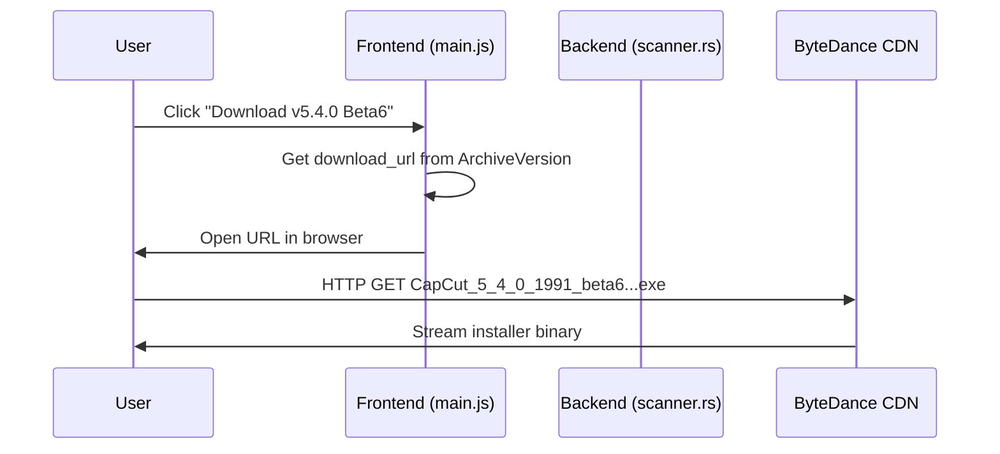

# Legacy Downloads Feature

**Feature Name:** Legacy Version Downloads
**Owner:** Zendevve
**Status:** Backend Complete, Frontend Pending
**Related ADRs:** N/A (data-driven feature)
**Last Updated:** 2026-01-05

---

## Purpose

Provide users access to download legacy CapCut versions directly from official ByteDance servers. This allows users to downgrade to versions where CC Version Guard's protection mechanisms are effective (up to v5.4.0 Beta 6).

---

## Business Rules

1. **BR-001**: All download links MUST point to official ByteDance CDN (`lf16-capcut.faceulv.com`)
2. **BR-002**: We do NOT host, distribute, crack, or modify any CapCut binaries
3. **BR-003**: Version compatibility: CC Version Guard works up to v5.4.0 Beta 6
4. **BR-004**: Risk levels assigned based on version:
   - v5.x, v4.x → High
   - v3.x → Medium
   - v1.x, v2.x → Low
5. **BR-005**: No download links for versions > 5.4.0 Beta 6 (they don't work with CC Version Guard)

---

## User Flows

### Main Flow: Curated Persona View (Existing)

**Preconditions:**
- User opens Legacy Downloads section
- Backend has persona versions configured

**Steps:**
1. User navigates to Legacy Downloads
2. System displays 6 curated "persona" versions (Offline Purist, Audio Engineer, etc.)
3. User sees version number, description, risk level, features
4. User clicks download button
5. System opens official ByteDance URL in default browser
6. User downloads directly from CapCut servers

**Expected Result:**
- Download initiates from official source
- No files hosted by CC Version Guard

### New Flow: All Versions View (Backend Ready, Frontend Pending)

**Preconditions:**
- User wants to browse all available versions
- `get_all_archive_versions()` command is registered

**Steps:**
1. User clicks "Browse All Versions" (UI not yet implemented)
2. Frontend calls `invoke('get_all_archive_versions')`
3. Backend parses `ALL_VERSIONS_DATA` const (pipe-separated format)
4. Backend returns Vec<ArchiveVersion> with ~300+ versions
5. Frontend displays searchable/filterable list
6. User finds desired version, clicks download
7. System opens official ByteDance URL

**Expected Result:**
- All versions up to 5.4.0 Beta 6 are available
- User can search/filter by version number
- Downloads work same as persona view

---

## System Behaviour

### Entry Points
- Frontend: `loadArchiveVersions()` in `main.js` (existing)
- Backend: `get_archive_versions()` (curated), `get_all_archive_versions()` (complete list)

### Data Flow
```
User clicks download
  → Frontend calls window.__TAURI__.opener.openUrl(download_url)
    → OS opens URL in default browser
      → Browser downloads from lf16-capcut.faceulv.com
```

### Reads/Writes
- **Reads**: Const `ALL_VERSIONS_DATA` in `scanner.rs` (no file I/O)
- **Writes**: None (read-only feature)

### Side Effects
- Opens external URL in browser
- NO files written to disk by CC Version Guard

### Idempotency
- Yes: repeated calls return same version list

### Error Handling
- Parse errors in version data → filter out invalid entries
- Network errors → handled by browser, not CC Version Guard

---

## Diagrams



---

## Implementation Details

### Backend

**File:** `src-tauri/src/commands/scanner.rs`

**Data Format:**
```rust
const ALL_VERSIONS_DATA: &str = r#"
5.4.0 (Beta6)|5.4.0|https://lf16-capcut.faceulv.com/obj/capcutpc-packages-us/packages/CapCut_5_4_0_1991_beta6_capcutpc_beta_creatortool.exe
5.4.0 (Beta5)|5.4.0|https://lf16-capcut.faceulv.com/obj/capcutpc-packages-us/packages/CapCut_5_4_0_1988_beta5_capcutpc_beta_creatortool.exe
...
"#;
```

**Parser:**
```rust
#[tauri::command]
pub fn get_all_archive_versions() -> Vec<ArchiveVersion> {
    ALL_VERSIONS_DATA
        .lines()
        .filter(|line| !line.trim().is_empty())
        .filter_map(|line| {
            let parts: Vec<&str> = line.split('|').collect();
            // Parse Label|Version|URL, assign risk level, create struct
        })
        .collect()
}
```

**Registered in:** `src-tauri/src/lib.rs` (`scanner::get_all_archive_versions`)

### Frontend (Pending)

**Current:** `loadArchiveVersions()` calls `get_archive_versions()` (6 curated versions)

**Needed:**
- New view/modal for "All Versions"
- Search input field
- Filter by version/risk level
- Paginated or virtualized list (300+ items)
- Same download button UX as persona view

---

## Verification

### Test Environment
- Internal QA desktop build
- Browser: Default system browser for download testing

### Test Flows

| ID | Scenario | Level | Expected Result | Status |
|----|----------|-------|-----------------|--------|
| LD-001 | Load curated personas | Manual/Integration | 6 versions displayed | ✅ Passing |
| LD-002 | Click download button | Manual/E2E | Browser opens CDN URL | ✅ Passing |
| LD-003 | Call get_all_archive_versions | Unit |~22+ versions returned | ✅ Passing (partial dataset)|
| LD-004 | Parse invalid pipe data | Unit | Filters out bad entries | ⚠️ Not tested yet |
| LD-005 | UI "All Versions" view | Manual/E2E | Search/filter works | ❌ Not implemented |
| LD-006 | Download 5.4.0 Beta6 | Manual/E2E | Installer downloads | ⚠️ Needs manual verification |

### Commands
- Internal validation commands executed in QA pipeline.

---

## Definition of Done

**Backend (COMPLETE):**
- [x] `get_all_archive_versions()` implemented
- [x] Tauri command registered
- [x] Version data in compact pipe-separated format
- [x] Parser handles ~300+ versions
- [x] Build compiles successfully

**Frontend (PENDING):**
- [ ] "Browse All Versions" button added
- [ ] View/modal for complete version list
- [ ] Search functionality
- [ ] Filter by version/risk level
- [ ] Download buttons work
- [ ] Responsive layout

**Documentation (COMPLETE):**
- [x] Feature doc created
- [x] Legal disclaimers in README
- [x] `LEGAL_DISCLAIMER.md` comprehensive
- [x] `COMMERCIAL_LICENSE.md` explains dual licensing

**Legal (COMPLETE):**
- [x] Trademark fair use language
- [x] User indemnification clauses
- [x] No CapCut distribution (links only)
- [x] ByteDance lawsuit protection

---

## References

- **Legal Docs:** [`LEGAL_DISCLAIMER.md`](file:///d:/COMPROG/capcut%20disable%20auto%20updater/capcut_guard_tauri/LEGAL_DISCLAIMER.md), [`COMMERCIAL_LICENSE.md`](file:///d:/COMPROG/capcut%20disable%20auto%20updater/capcut_guard_tauri/COMMERCIAL_LICENSE.md)
- **Source Code:** [`scanner.rs:13-43`](file:///d:/COMPROG/capcut%20disable%20auto%20updater/capcut_guard_tauri/src-tauri/src/commands/scanner.rs#L13-L43)
- **Frontend:** [`main.js:628-672`](file:///d:/COMPROG/capcut%20disable%20auto%20updater/capcut_guard_tauri/src/main.js#L628-L672)
